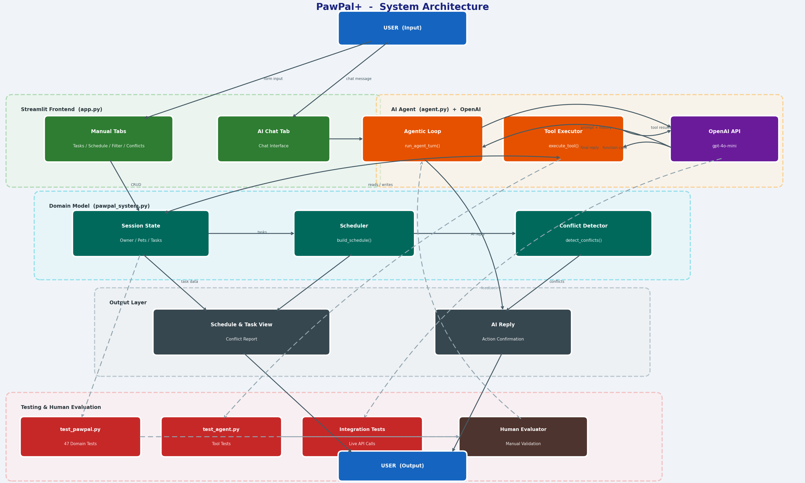
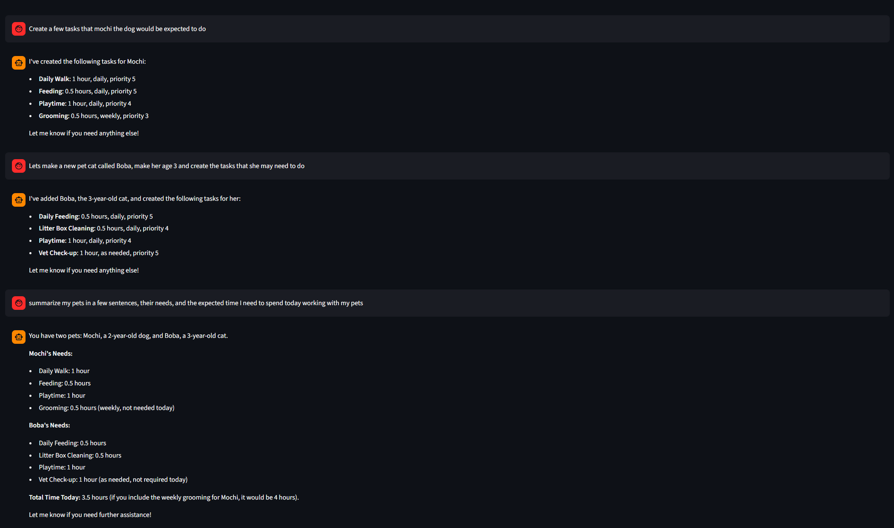
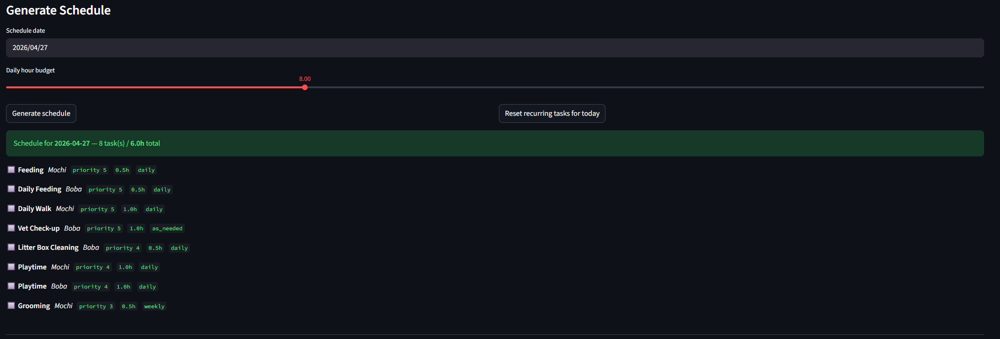

# Module 4 Submission: PawPal++ (Module 2 Project)

PawPal++ is a pet care scheduling AI native tool implemented in Python, designed as a Streamlit app (entrypoint in `app.py`).
It helps pet owners manage pets, tasks, and daily schedule generation with priority handling.

## Architecture Overview



Blue — User (input/output)
Green — Streamlit Frontend (Manual Tabs + AI Chat)
Orange — AI Agent (Agentic Loop + Tool Executor)
Purple — OpenAI API
Teal — Domain Model (Session State, Scheduler, Conflict Detector)
Grey — Output Layer
Red/Brown — Testing & Human Evaluation (dashed lines)

## Setup Instuctions

1. Create venv and install:

```bash
python -m venv .venv
.venv\Scripts\activate   # Windows
pip install -r requirements.txt
```

2. Set up your API key:

```bash
cp .env.example .env   # then paste your OpenAI key into .env
```

3. Run app:

```bash
streamlit run app.py
```

## Sample Iterations



## Design Decisions

While working on this project, I wanted to ensure that the regular flow of pawpal++ was still functional, while adding a new add-on that allows use of AI calls. By integrating AI calls directly into typical workflows, such as creating tasks, and being able to summarize the needs of the pets I have, I was able to maintain both the general flow and a specialized flow for pet management

## Testing Summary

10/10 passed — every agent capability verified (listing, creating, completing, removing tasks, adding pets, schedule, conflict detection, unknown pet handling, reset recurring)
Average confidence: 7.2/10 (scored by a second model call rating each response)
51 seconds total run time

## Reflection

### What are the limitations or biases in your system?

Personally, I believe the biggest limitation for this system is the granular control of modifiability the AI possesses. In order to let it access the different parts of my system, the different use cases need to be hard coded. AI output is also limited based on good human input and data

### Could your AI be misused, and how would you prevent that?

As it stands, the AI could currently be misused as there is no restriction in prompting. You could ask it anything and it would work. To prevent it, I would have to adjust my prompting so that it only responds to use requests with pets.

### What surprised you while testing your AI's reliability?

The AI is really good at handling requests that I provide it, such as creating tasks, summarizing tasks, etc

### describe your collaboration with AI during this project. Identify one instance when the AI gave a helpful suggestion and one instance where its suggestion was flawed or incorrect.

While working on this project with AI, it had offered many helpful tips towards how I wanted to structure the application. Little things such as maintaining general flow while making a new tab for the AI chatbot were helpful. There were times when creating the agents where the AI failed to highlight key security practices such as using .env, where I had to steer it in the right direction and tell it to make my API keys and secrets in a .env